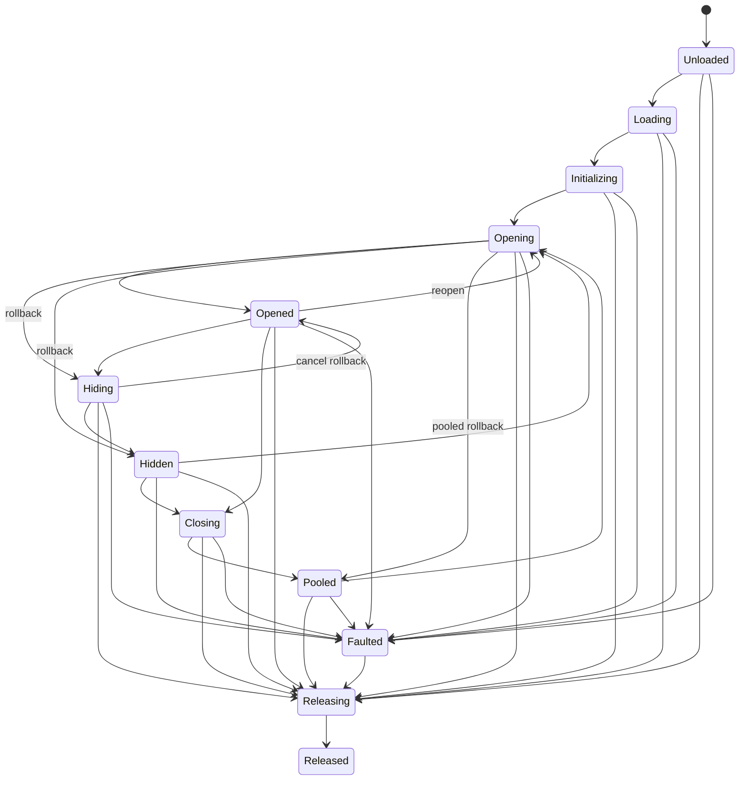

# Y2 Lifecycle State Machine

Stage 2 gives every `BaseContext` one explicit state machine and at most one active lifecycle operation. Invalid transitions and concurrent re-entry fail immediately instead of allowing callbacks, pooling, and the active registry to diverge.

## State graph

The complete state set is `Unloaded`, `Loading`, `Initializing`, `Opening`, `Opened`, `Hiding`, `Hidden`, `Closing`, `Pooled`, `Releasing`, `Released`, and `Faulted`. `Unloaded`, `Opened`, `Hidden`, `Pooled`, and `Released` are stable states; `Unloaded` is the initial pre-operation state. `Loading`, `Initializing`, `Opening`, `Hiding`, `Closing`, and `Releasing` are transient states owned by one operation. `Faulted` records a terminal lifecycle failure before forced release; manager-owned failure paths continue cleanup to `Released`. A transition to the current state is accepted as an idempotent no-op; all other legal edges are shown above.

Legacy enum names remain aliases only: `None` is `Unloaded`, `Shown` is `Opened`, `Closed` is `Pooled`, and `Destroyed` is `Released`.

## Unified open semantics

All three `OpenAsync<T>` paths finish in `Opened`, set `CloseDisposition` to `None`, and run under an `Open` operation. New and pooled contexts enter the active registry only after success; an existing context remains registered while its refresh either succeeds or rolls back to its previous stable state.

| Path | Callback and transition order |
|---|---|
| New | `Unloaded -> Loading`; load and instantiate; `Initializing`, bind, `OnInit`; `Opening`, `OnShow`, show transition; `Opened` |
| Existing active | Capture `Opened` or `Hidden`; `Opening`, activate/re-layer, `OnShow`, show transition; `Opened` |
| Pooled | Remove from pool; bind; `Pooled -> Opening`, activate/re-layer, `OnShow`, show transition; `Opened` |

`OnInit` runs once and only on the new-instance path. `OnShow` runs during `Opening`, before the show transition completes and before `Opened` is published. Reopening an active or pooled context does not rerun `OnInit`.

## Operations and cancellation

Each context exposes the active `CurrentOperationId` and `CurrentOperationKind`. `UIOperationId` is a process-wide increasing identifier; kinds are `Open`, `Close`, `Hide`, `Show`, and `Release`. Starting a second operation on the same context throws `UIOperationInProgressException` with the conflicting operation metadata.

Every operation owns a linked `CancellationToken` composed from:

- the caller token,
- the context `LifetimeToken`, and
- the service lifetime token.

Disposing the operation disposes its linked token source, clears the context's current operation, and decrements the service's in-flight count. The context lifetime is canceled and disposed during release. Shutdown cancels the service lifetime so in-flight operations observe cancellation. Shutdown-only cleanup operations deliberately omit the canceled service token so cleanup can finish.

## Close, pool, and release

Closing an opened context runs `Hiding`, the hide transition, `OnHide`, then `Hidden`; it then enters `Closing` and runs `OnClose`. `CloseDisposition` states the intended terminal action before callbacks observe it:

- `Pool`: cache the context and finish in `Pooled`.
- `Release`: run release cleanup and finish in `Released`.
- `None`: no close decision is active.

A hidden context starts directly at `Closing`. Release enters `Releasing`, invokes `OnDestroy` once for initialized contexts, releases the resource when owned, cancels the context lifetime, removes runtime bookkeeping, and finishes in `Released`. Destroy-callback and resource-release errors are collected without skipping the remaining cleanup; the context still reaches `Released`, and the collected failure is recorded in `LastFailure`.

`ClearPool<T>`, `ClearAllPools`, and shutdown continue releasing remaining contexts after an individual destroy or resource-release error. They report collected errors as `AggregateException` after cleanup has been attempted for every target.

## Failure and rollback

Cancellation of an existing open restores its previous `Opened` or `Hidden` state. Cancellation of a pooled open returns the context to the pool when rollback succeeds. Cancellation of a new open runs close rollback and releases the instance/resource. A canceled hide transition restores `Opened` and keeps the context active.

Lifecycle callback or transition failures are stored in `LastFailure` and surfaced as `UILifecycleException`, which carries context type, state, operation ID, operation kind, phase, and the original failure. If rollback also fails, errors are aggregated and the context is forced through `Faulted -> Releasing -> Released`, preventing a damaged instance from remaining active or pooled.

## Stage 4 runtime state

Binding now also resolves the context's profile layer/modal policy. A context receives a
bounded sorting lease before `OnInit`/`OnShow`. Successful show publishes interaction,
modal, and focus state. Navigation hide removes visibility/modal/focus but retains sorting
identity; pool, release, terminal failure, and shutdown remove all runtime state and dispose
the lease. Refresh rollback restores the prior sorting position.

## Shutdown and stage boundary

`ShutdownAsync` rejects new operations, cancels the service lifetime, waits until all in-flight operations have disposed, then closes active contexts, clears pools, navigation, messages, registration, and finally the stage 4 root/interaction/input runtime. Cleanup errors are aggregated; successful cleanup returns the service to the uninitialized state and permits later reinitialization.

Stage 3 replaces the stage 2 fast-failure-on-concurrent-re-entry default with a per-context-type FIFO command queue (`UIOperationCoordinator`), a single-flight merge policy for equivalent concurrent first-creation `Open` calls, a navigator-owned FIFO transaction queue for Push/Pop/Replace/Back/BringToTop, an async navigation guard extension point, and non-destructive-first transaction rollback with destructive-failure convergence. The state graph, operation/cancellation model, close/pool/release rules, and failure/rollback semantics described above are unchanged; stage 3 only changes *how many* operations for the same key can be in flight at once and in what order they run. See [Navigation.md](Navigation.md) for the complete stage 3 contract.

Stage 4 does not change the state graph or stage 3 FIFO/single-flight rules. It attaches
sorting/modal/input/focus state to the same transactional lifecycle and keeps stage 5
resource ownership out of scope.
